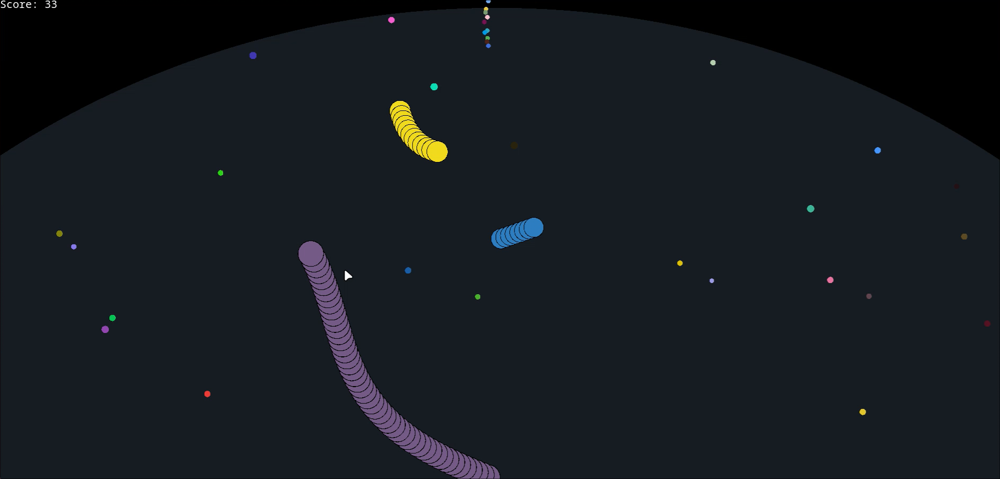
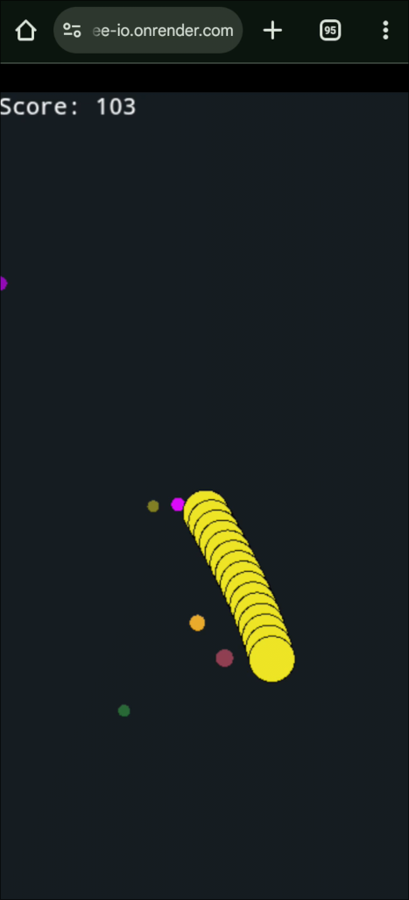
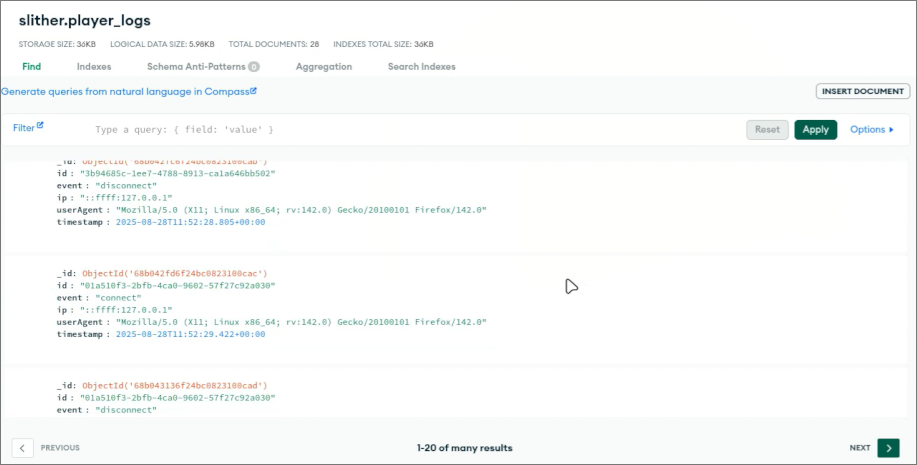

# 🐍 snakeee-io 

A simple **Slither.io clone** built with:  
- **Server:** TypeScript, Express, WS  
- **Client:** PixiJS  
- **Database:** MongoDB (for logs)

---

## Screenshots

### Desktop


### Mobile


### Logs in MongoDB


---

## Build from Source

Clone the repo with `git clone`:
Build the project:

```bash
npm run build
```

Start the server:

```bash
npm run start
```

Game is running on `localhost:8080`

---

## Contributions

If you want to contribute, feel free to open an issue or a pull request

